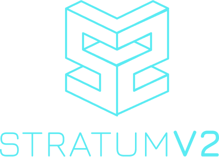
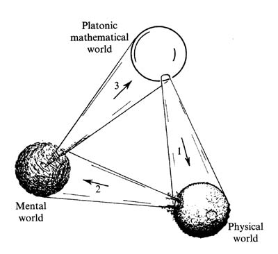
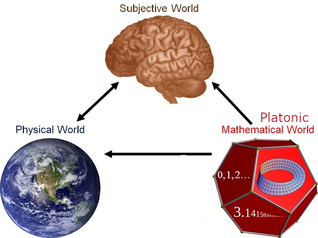
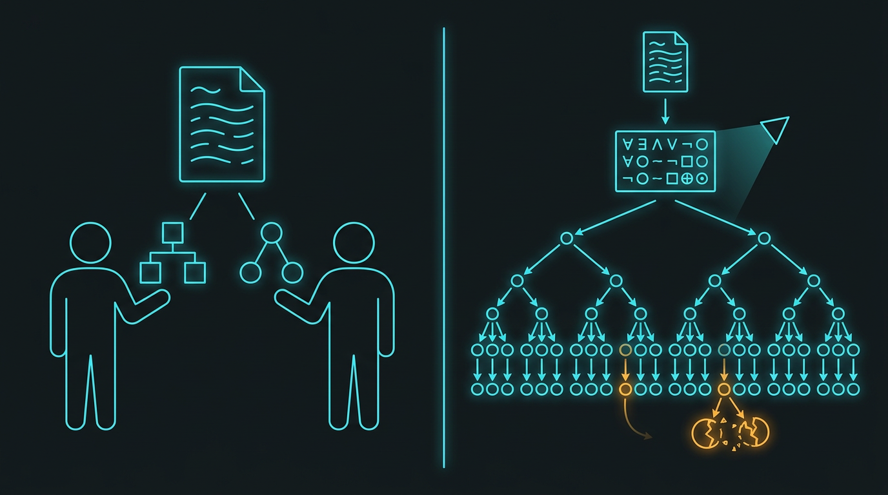
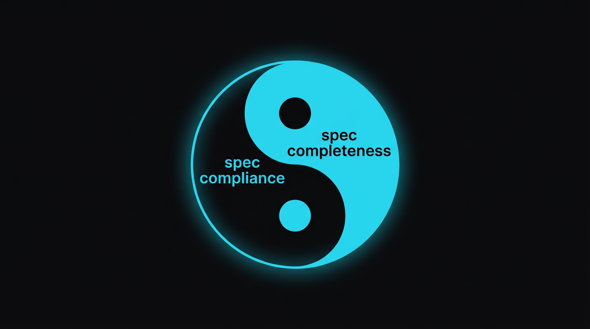

<!-- _class: title -->
<!-- _paginate: false -->

∀
∃
∧
¬
∨
□
⊕
⊙

# towards Sv2 spec **COMPLETE**ness 👨‍💻 🤖 📜

plebhash · SRI R&D call · 2026-10-01

---

<!-- _class: center -->

## Penrose's 3 worlds

---

<!-- _class: center -->

## Penrose's 3 worlds

---

Somewhere in the platonic realm of all possible Bitcoin mining protocols there is a **COMPLETE** Sv2 spec.

What we have today is a **DRAFT**.

Good enough to start building on.

But still **WIP**.

---

In this talk, I want to convince you that:
- finding a **COMPLETE** Sv2 spec is possible.
- arriving at a **SPEC-COMPLIANT** Reference Implementation is also possible.
- both journeys above feed back into each other.

---

A few words to define:
- **specification**
- **completeness**
- **formal verification**
- **compliance**

---

<!-- _class: dense -->

# **specification**

A body of English prose, written and read/interpreted by humans (and AI agents). This is where the protocol first **exists**: it is drafted here, and reasoned about here.

It defines the **objects** of the protocol and the rules that bind them:

- **actors**: who takes part
- **state**: what each actor holds at any moment
- **vocabulary**: the messages, fields and identifiers they exchange
- **relations**: what must already hold before an actor may act
- **actions**: what an actor may do next, and what that changes

From these, **"what happens next?"** should follow for every situation.

A **gap** is where two readers derive different answers, and both are "compliant".

<!--
Say the Sv2 instances out loud: actors are mining device, proxy, pool, template provider, job declarator; vocabulary is SetupConnection, channel_id, job_id, the share; relations are things like "a share references a job on a channel this connection opened"; actions are SubmitShares and its accept/reject. Two implementations that never met interoperate only if they derive the same answer. A gap is not a crash, it is a fork in behaviour nobody notices until two implementations meet. Concrete Sv2 gap example here.
-->

---

# (consistent) **completeness**

- **Completeness**: for every reachable state and every message, the text says **what happens next**. A complete protocol spec has **no gaps**.

- **Consistency**: the text never says two **contradictory** things.

A spec that contradicts itself "says" everything, so it is trivially complete (not really what we're aiming for). The goal is **both**.

Note: **Gödel's incompleteness** does not apply here: a finite state machine cannot encode arithmetic, and every question about a finite structure has exactly one answer.

<!--
The pair "complete and consistent" is Hilbert's program (1920s): give all of mathematics axioms that are both. Gödel (1931) showed any axioms strong enough for arithmetic can never be both. That is why completeness alone is a bad target: an inconsistent theory proves everything. A protocol escapes Gödel because its theory cannot encode arithmetic; Sv2 does arithmetic inside (targets, difficulty) but on fixed-width values, never as a theory of the naturals. On "finite": Sv2 state is bounded per connection; unbounded queues or sequences would make the state infinite in principle, which is exactly what a TLA+ model bounds before checking. Not every open choice is a gap: pool policy, timeouts, retries are freedom we chose; a gap is freedom nobody chose. Implementers will ask this.
-->

---

# completeness **≠ no freedom**

Complete does not mean no freedom of implementation. A choice the text grants explicitly is a **MAY** (RFC2119), not a **gap**.

for example, *§5.3.13*:
> A server MAY aggregate acknowledgements for multiple successful share-submission messages from the same channel into a single `SubmitShares.Success` response.

<!--
Contrast with a gap: there both readers are also "compliant", but by accident, because the text was silent. Freedom we chose versus freedom nobody chose. Pool policy, timeouts, retries are the same kind of MAY.
-->

---

<!-- _class: dense -->

# **formal verification**

English is **interpreted**. Two careful readers can disagree, and both be right about the text (even if they're AI agents). That is what a **gap** is.

**Formalization** rewrites the spec in a notation where every symbol has exactly one meaning. The text is no longer interpreted, it is **evaluated**: same question, same answer, whoever asks.

In languages such as TLA+, the spec becomes a body of **formulae** (logical, not arithmetic) that say which state transitions the protocol allows. That body of formulae constitutes a **model**.

**Formal verification** (FV) means running a **model checker** (e.g.: TLC). This process is deterministic and exhaustive, as it walks **every reachable state**:
- a state with no next step is a gap
- a broken invariant is a contradiction

<!--
Formal verification demystified: not proving code correct, but writing the protocol a second time in a notation a machine can exhaustively explore (formalization), then letting the machine explore it (verification). Lamport's point is that a TLA+ spec is a formula: initial state, and at every step one of the allowed transitions. Nothing new: AWS, Paxos, Raft were checked this way. TLC literally reports a state with no enabled action as a "deadlock", the mechanical detector for silent gaps. The English and formal texts are mirrors of the same protocol; where they disagree, one of them has a gap. The verify/validate split is the principled reason humans stay in the loop: the formula has no oracle for intent but us.
-->

---

<!--
Formal verification in one picture. Left: the same English text, two careful readers, two different diagrams. That is interpretation, and the difference between the diagrams is a gap. Right: the same text rewritten as a formula, a block of notation with one meaning, and the formula unfolded into every state it allows, walked by a checker with no imagination involved. The two amber spots are what it reports: an arrow that leads nowhere is a state with no next step, a gap; a node whose arrows point at clashing targets is a broken invariant, a contradiction.
-->

---

# FV: **silver bullet (?)**

FV is arguably the only way we can **assert spec completeness** in a **deterministic** and **exhaustive** manner.

LLMs are merely stochastic interpreters. Increasingly better every day, but still fundamentally limited for asserting completeness.

---

# FV: **fundamental limitations**

The assertion of spec completeness is only as good as the model. **Model nonsense, and we're verifying nonsense.**

And it only ever checks **small setups**: the checker walks every state, but only for sizes fixed up front (e.g.: 2 channels and 3 queued jobs).

Anything too big, the number of states explodes and verification becomes **infeasible**.

---

# spec **compliance**

An **implementation** is **spec-compliant** when:
**A.** it never does what the spec forbids. No broken invariants.
**B.** it does everything the spec requires. No missing behaviour.

A few techniques already established around SRI:

I. **Fuzzing** maps SRI with regards to spec compliance.
II. **Interoperability Tests** map Sv2 ecosystem (3rd party implementations that potentially diverge from SRI) with regards to spec compliance.
III. **Integration Tests** catch regressions on SRI, and CI enforces they're not unintentionally re-introduced.

All of them also surface potential spec gaps, **feeding back** into our journey towards **spec completeness**.

---

<!--
Compliance and completeness are two halves of one thing. A compliant implementation is only as meaningful as the spec it complies with, and a complete spec is only as real as the implementations that follow it. Each contains a seed of the other: interop divergences between compliant implementations are where gaps show up, and closing a gap changes what compliance means. The third promise bullet, drawn.
-->

---

<!-- _class: center -->

# **paths** to a complete spec

(*) "no gaps found" ≠ "no gaps": LLMs, fuzzing, interop and integration tests only find the gaps someone tripped over. And FV of spec completeness is only as good as the model. Model nonsense, and you're verifying nonsense.

<!--
Four detectors, not four alternatives: they run in parallel and each needs something different first. LLM review needs nothing but the text. The model checker needs a formal model, which is the formalization cost. Fuzzing needs SRI. Interop tests need SRI and someone else's implementation, and they are the only detector that finds a gap the way the specification slide defined it: two compliant readers disagreeing. Everything converges on candidate gaps, and the one step no tool does is the diamond: deciding whether a candidate is a gap to close or freedom to keep as a MAY. That is a design choice, and it is where human hours go. A spec change then loops back. The exit is the complete spec, with a question mark on purpose. Two edges reach it with different weight: from the sampling detectors "nothing found" is evidence; from the checker "nothing reachable" is a fact for the checked sizes. The dashed "blind spots" edge from the formal model into the same node is the caveat: whatever the model left out, abstracted away, or got wrong about the English, the "complete" spec inherits. Model checkers verify; validating the model against what we meant is human work, done when the model is written or changed, not on every run. Attainable by any path, assertable only by the checker, and even that assertion is only as good as the model. Completeness is per version: a new feature reopens the loop. Not drawn: after a spec change the model and SRI both have to follow, or they drift; that is the maintenance cost the table warned about.
-->

---

# is formal verification **worth the effort?**

We have **LLM**s. They read the whole spec in seconds, for cents, and they get better every day.

So if clankers can hunt gaps in the English directly, **why write the spec a second time (and maintain it), in a language none of us can read (e.g.: TLA+)?**

Moreover, FV has limitations:
- model sanity
- verification complexity

BUT: **FV is still** (arguably) **the only way we can assert completeness!**

No easy answer, this is a **dilemma.**

<!--
State the counter-argument at full strength before answering it. This is the objection most of the room is already thinking, and Edil may raise the opposite one. No verdict here; the next slide is the table, and the room decides.
-->

---

<!-- _class: dense -->

# arguments for vs against formal verification

| | **FV** | **no FV** |
|---|---|---|
| for | <ul><li>a durable artefact, re-checked on every spec change (assuming the model is also updated)</li><li>writing the model surfaces ambiguity before any checking runs</li><li>(arguably) **only way we can assert completeness**</li></ul> | <ul><li>KISS</li><li>comfort zone</li><li>**easy to manage engineering efforts**</li></ul> |
| against | <ul><li>a second artefact that can drift from the English (extra maintenance burden)</li><li>none of us can write or review FV languages today</li><li>verification size/complexity ceiling</li><li>**competes for the scarce resource: human hours**</li></ul> | <ul><li>LLM = a stochastic interpreter, not a deterministic evaluator</li><li>"found no gap" ≠ "no gaps exist"</li><li>LLMs only "imagine" states, like humans</li><li>LLMs are prone to "hallucinations"</li><li> a closed gap can silently reopen and nobody is warned</li><li>**no assertion of completeness**</li></ul> |

<!--
Keep it neutral on the slide; the room decides. Points to have ready if asked. The two are not substitutes: an LLM is a reader, in the same world as us on the Penrose picture; a model checker is an evaluator. LLMs lower the cost of the model path: they can draft TLA+ from the English, explain a counterexample trace in plain words, and flag where the English and the model disagree. The drift problem cuts both ways: an LLM review has no artefact to drift from, which is exactly why nothing accrues. The validate problem is identical on both paths: neither a reader nor a checker knows what we meant. Bounded checking is the honest ceiling. The checker walks every reachable state, but only for a finite instance: you pin the counts (channels, jobs in flight, queue depth) before running, and the state space multiplies with each extra actor or value, so runs go from seconds to never. "No gap found" therefore means "no gap up to those sizes"; a gap needing four jobs during a prev-hash change is outside a three-job walk. Why it is accepted anyway: the small-scope hypothesis, most protocol bugs come from interleavings of a few actors, not from large counts, and AWS found bugs at 3 to 5 nodes that years of testing at scale had missed. Confidence grows by raising the counts until nothing new appears. Unbounded claims need proofs (TLAPS), far costlier, not where Sv2 should start. Cost is the real argument against: the bottleneck is human hours, and the model path spends them up front.
-->

---

# formal verification **open questions**

- in which time horizon do we need spec completeness?
- how much effort to translate the entire spec?
- how much effort to translate parts of the spec (e.g.: subprotocols in isolation)?
- how much effort to maintain the model (in face of spec changes)?
- which language to use? TLA+? Quint? P? something else?

I'm not in a rush to answer these questions.

For now, they remain open for exploration.

---

<!-- _class: center -->

# paths to a **complete spec**

(*) "no gaps found" ≠ "no gaps": LLMs, fuzzing, interop and integration tests only find the gaps someone tripped over. And FV of spec completeness is only as good as the model. Model nonsense, and you're verifying nonsense.

---

# humans **in the driver seat**

Whatever path we take, clankers do the reading, the drafting and the walking. **Humans decide.**

- closing a gap is a **design choice**: only the community can make it
- validating a model against what we **meant** has no oracle but us
- nothing new here: established Computer Science methods, with AI as the **accelerator** of human agency

So the bottleneck is **human bandwidth**: review, decisions, coordination. Every step of the roadmap has to be sized for it.

<!--
This is the frame for the discussion that follows. Not humans versus AI: AI does the volume, humans do the judgement, and judgement is the scarce input. The two places where a human is structurally required are the two diamonds in the story: deciding whether a candidate is a gap or a MAY, and validating that a model says what we meant. Everything else can be accelerated. The roadmap question is therefore not "what can the tools do" but "how much human judgement per week can we actually spend, and where".
-->
